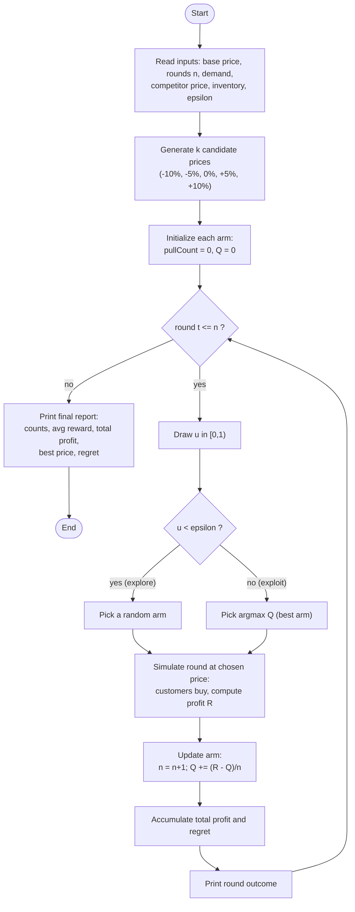
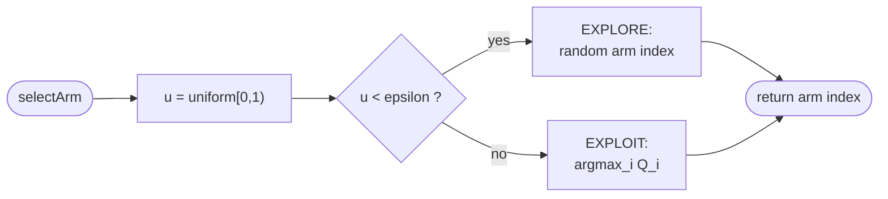

# 7. Flowchart

## 7.1 Mermaid: overall control flow



## 7.2 Mermaid: action selection detail



## 7.3 ASCII flowchart (overall loop)

```
              +-------------------------------+
              |            START              |
              +-------------------------------+
                             |
                             v
        +--------------------------------------------+
        | Read inputs: base price, n, demand,        |
        | competitor price, inventory, epsilon       |
        +--------------------------------------------+
                             |
                             v
        +--------------------------------------------+
        | Generate k candidate prices                |
        | (-10%, -5%, 0%, +5%, +10%)                 |
        +--------------------------------------------+
                             |
                             v
        +--------------------------------------------+
        | Initialize arms: pullCount = 0, Q = 0      |
        +--------------------------------------------+
                             |
                             v
                   +--------------------+     no
                   |   round t <= n ?   |-------------+
                   +--------------------+             |
                             | yes                    |
                             v                        v
            +-----------------------------+   +-----------------------+
            | Draw u in [0,1)             |   |  Print final report:  |
            +-----------------------------+   |  counts, avg reward,  |
                             |                |  total profit, best   |
                             v                |  price, regret        |
                  +---------------------+     +-----------------------+
                  |   u < epsilon ?     |                 |
                  +---------------------+                 v
                    | yes         | no             +------------+
                    v             v                |    END     |
        +----------------+  +------------------+    +------------+
        | EXPLORE:       |  | EXPLOIT:         |
        | random arm     |  | argmax_i Q_i     |
        +----------------+  +------------------+
                    \           /
                     v         v
            +--------------------------------+
            | Simulate round -> profit R     |
            +--------------------------------+
                             |
                             v
            +--------------------------------+
            | Update: n=n+1; Q += (R-Q)/n    |
            +--------------------------------+
                             |
                             v
            +--------------------------------+
            | Accumulate profit & regret;    |
            | print round; go to next round  |
            +--------------------------------+
                             |
                             +-----> (back to "round t <= n ?")
```
